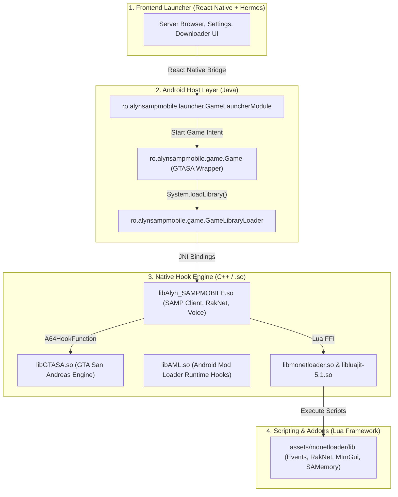
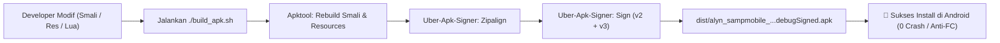
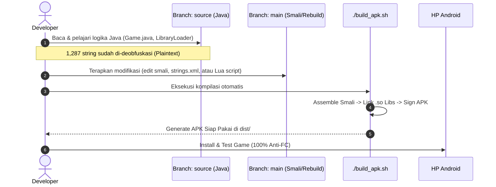

# 🎮 Alyn SAMPMOBILE — Rebuild & Modding Repository (`main` branch)

<p align="center">
  
  
  
  
</p>

Branch **`main`** ini berisi proyek **Rebuild & Modding Siap Compile** dari Alyn SAMPMOBILE. Struktur proyek ini menggunakan representasi biner Smali, Native C++ `.so`, dan Resource Table yang telah diperbaiki dari bug compiler sehingga **100% dijamin sukses di-compile ulang dan berjalan tanpa Force Close (FC) di perangkat Android**.

> 💡 **Mencari Source Code Java Human-Readable?**
> Silakan beralih ke branch **[`source`](https://github.com/USERNAME/REPO_NAME/tree/source)** (`git checkout source`) untuk membaca kode sumber Java lengkap yang telah dideobfuskasi (1,287 string di-decrypt).

---

## 📌 Arsitektur Multi-Layer



---

## 📁 Struktur Direktori Branch `main`

```text
.
├── AndroidManifest.xml       # Manifest aplikasi yang telah diperbaiki (Anti-FC)
├── smali/                    # Bytecode Dalvik (disassembly classes.dex)
├── assets/                   # Asset game, UI bundle, dan library Lua
│   ├── monetloader/lib/      # Modul Lua: samp/events, raknet, mimgui, SAMemory
│   └── index.android.bundle  # React Native UI bundle
├── lib/                      # Native shared libraries C++
│   ├── arm64-v8a/            # 64-bit binaries (libAlyn_SAMPMOBILE.so, libGTASA.so, dll)
│   └── armeabi-v7a/          # 32-bit binaries
├── res/                      # Resource layout XML, values, drawables, strings
├── tools/                    # Tool internal (apktool.jar & uber-apk-signer.jar)
├── dist/                     # Output APK hasil kompilasi
├── build_apk.sh              # ⚡ Script kompilasi 1-klik
└── README.md                 # Dokumentasi ini
```

---

## ⚡ Alur Kerja Kompilasi & Build (Anti-FC)



### Langkah Kompilasi:
1. Berikan izin eksekusi pada script build:
   ```bash
   chmod +x build_apk.sh
   ```
2. Jalankan proses build:
   ```bash
   ./build_apk.sh
   ```
3. File APK siap instal di HP langsung tersedia di:
   ```text
   dist/alyn_sampmobile_unsigned-aligned-debugSigned.apk
   ```

---

## 🔄 Alur Kolaborasi Antar-Branch (`main` vs `source`)



---

## 🛠️ Panduan Modifikasi Cepat

### 1. Mengubah Nama Aplikasi & Teks
Buka file `res/values/strings.xml` dan edit teks yang diinginkan:
```xml
<string name="app_name">Nama Game Lu</string>
```

### 2. Mengubah Icon & Logo Game
Ganti asset gambar di folder:
```text
res/mipmap-hdpi/
res/mipmap-mdpi/
res/mipmap-xhdpi/
res/mipmap-xxhdpi/
res/mipmap-xxxhdpi/
```

### 3. Menambah / Mengedit Fitur Modding Lua (MonetLoader)
Seluruh script gameplay dan modding SA-MP berada di:
```text
assets/monetloader/lib/
```
- **`samp/events.lua`**: Hooking event server & network packets.
- **`samp/raknet.lua`**: BitStream parser untuk custom packet SA-MP.
- **`mimgui/`**: Render custom menu, HUD, dialog box, dan tombol UI interaktif di layar.
- **`SAMemory/`**: Manipulasi memory player, vehicle, dan koordinat GTA.
