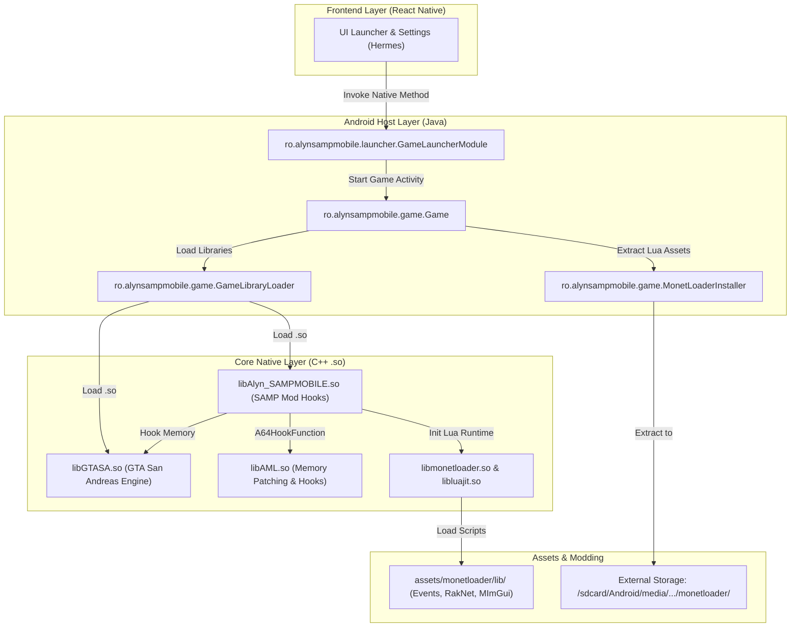
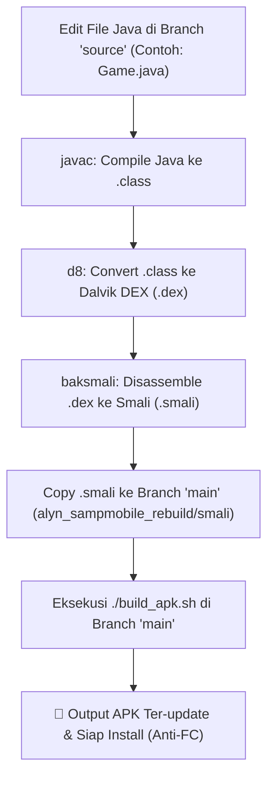

# 👁️ Alyn SAMPMOBILE — Human-Readable Java Source Code (`source` branch)

<p align="center">
  
  
  
  
</p>

Branch **`source`** ini berisi kode sumber Java hasil dekompilasi lengkap dari **Alyn SAMPMOBILE** yang telah dirapikan dan dideobfuskasi agar **mudah dibaca, dipahami, dan dipelajari oleh programmer**.

> ⚡ **Ingin Mengompilasi Ulang APK Tanpa Force Close?**
> Untuk kebutuhan modifikasi langsung dan kompilasi APK anti-FC, silakan gunakan branch **[`main`](https://github.com/USERNAME/REPO_NAME/tree/main)** (`git checkout main`) yang sudah dilengkapi build script 1-klik `./build_apk.sh`.

---

## 📌 Diagram Arsitektur & Hubungan Komponen



---

## 📁 Struktur Direktori Branch `source`

```text
.
├── app/
│   ├── build.gradle
│   └── src/main/
│       ├── AndroidManifest.xml          # Manifest aplikasi
│       ├── java/                        # Source code Java (Deobfuscated)
│       │   ├── ro/alynsampmobile/
│       │   │   ├── game/                # Game.java, GameLibraryLoader.java, MonetLoaderInstaller.java
│       │   │   └── launcher/            # GameLauncherModule.java, Ads, Downloader service
│       │   ├── com/rockstargames/gtasa/ # Wrapper GTASA bawaan Rockstar
│       │   ├── com/wardrumstudios/utils/# Gamepad, media, billing utilities
│       │   └── com/facebook/react/      # React Native host runtime
│       ├── assets/                      # Asset game, fonts, dan modul Lua
│       ├── lib/                         # Native library C++ (arm64-v8a & armeabi-v7a)
│       └── res/                         # Android layout XML, drawable, colors
├── build.gradle                         # Root Gradle config
├── settings.gradle                      # Gradle settings
└── README.md                            # Dokumentasi ini
```

---

## 🔍 Analisis File Java Kunci

| File Java | Deskripsi & Fungsi |
|---|---|
| [`ro/alynsampmobile/game/Game.java`](app/src/main/java/ro/alynsampmobile/game/Game.java) | Activity utama game GTA SA / SA-MP. Mengatur siklus hidup aplikasi, in-game keyboard controller, screenshot writer, cache cleaner (`MINFO.BIN`), dan JNI binding (`initialize`, `initializeMonet`, `multiTouchEvent4Ex`). |
| [`ro/alynsampmobile/game/GameLibraryLoader.java`](app/src/main/java/ro/alynsampmobile/game/GameLibraryLoader.java) | Pemuat pustaka native C++ secara berurutan: `libGTASA.so` -> `libBASS.so` -> `libcrashlytics.so` -> `libAlyn_SAMPMOBILE.so`. |
| [`ro/alynsampmobile/game/MonetLoaderInstaller.java`](app/src/main/java/ro/alynsampmobile/game/MonetLoaderInstaller.java) | Mengekstrak framework Lua MonetLoader (`monet-3.8.0-os-2026-06-24-imgui172-rollback`) ke storage eksternal perangkat. |
| [`ro/alynsampmobile/launcher/GameLauncherModule.java`](app/src/main/java/ro/alynsampmobile/launcher/GameLauncherModule.java) | Bridge antara UI React Native dengan Android SDK: `startGame()`, `pingServer()` (UDP SA-MP query), dan `installApk()`. |

---

## 🔓 Status Deobfuskasi String

APK ini aslinya menggunakan enkripsi string runtime berbasis R8 (`AbstractC2832zN.i(long)`). 

Pada branch ini, seluruh **1,287 panggilan enkripsi string telah didekripsi** menggunakan reflective JVM deobfuscator sehingga seluruh string terbaca langsung dalam format plaintext (contoh: tag logger, nama file biner cache, konfigurasi shared preferences, dan intent flags).

---

## 🔄 Alur Pipeline: Mengonversi Perubahan Java ke Smali (Branch `main`)


